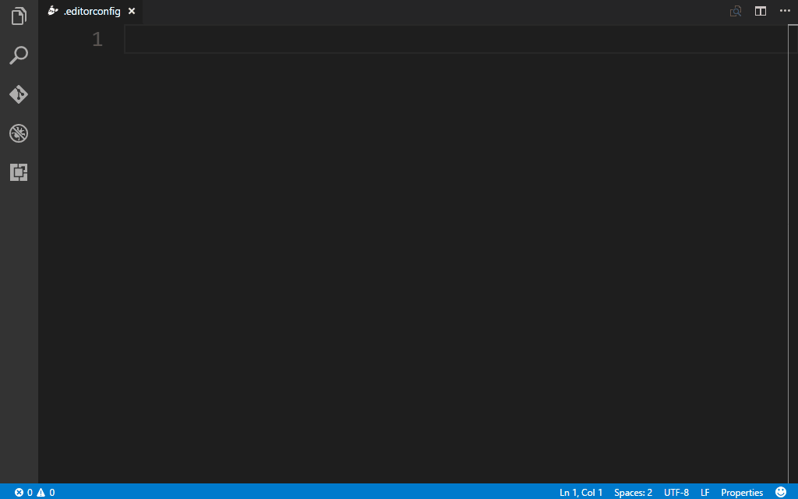

# VSCode Essentials Snippets

> A collection of essentials snippets for Visual Studio Code.



Snippets are generated with [snippet-generator](https://snippet-generator.app/).


# Installation

1. Install [Visual Studio Code](https://code.visualstudio.com/)
2. Launch Visual Studio Code
3. Choose **Extensions** from menu
4. Search for `@m-fe/vscode-snippets`
5. Click **Install** to install it
6. Click **Reload** to reload the Code

# Usage

Type part of a snippet, press `enter` and the snippet unfolnds. For snippets in markdown format you need to press `ctrl+space` (Windows / Linux) or `cmd+space` (OSX).

## Angular snippets

### TypeScript snippets

| Snippet              | Content                      |
| -------------------- | ---------------------------- |
| `ng-class`           | Angular Class                |
| `ng-component`       | Angular Component            |
| `ng-component-input` | Angular Component with Input |
| `ng-directive`       | Angular Directive            |
| `ng-enum`            | Angular Enum                 |
| `ng-guard`           | Angular Guard                |
| `ng-interface`       | Angular Interface            |
| `ng-module`          | Angular Module               |
| `ng-pipe`            | Angular Pipe                 |
| `ng-service`         | Angular Service              |

### RxJS Snippets

| Snippet               | Content                     |
| --------------------- | --------------------------- |
| `rx-extensions`       | RxJS Extensions import      |
| `rx-observable`       | RxJS Observable import      |
| `rx-subject`          | RxJS Subject import         |
| `rx-subject-behavior` | RxJS BehaviorSubject import |
| `rx-subject-replay`   | RxJS ReplaySubject import   |
| `rx-add-observable`   | RxJS add observable import  |
| `rx-add-operator`     | RxJS add operator import    |

### HTML snipppets

| Snippet               | Content                                   |
| --------------------- | ----------------------------------------- |
| `ng-ngFor`            | Angular \*ngFor                           |
| `ng-ngIf`             | Angular \*ngIf                            |
| `ng-ngModel`          | Angular ngModel                           |
| `ng-routerLink`       | Angular routerLink                        |
| `ng-routerLink-param` | Angular routerLink with a route parameter |
| `ng-select`           | select control with ngModel               |
| `ng-pre`              | Angular pre with json                     |

## Continuous Integration snippets

| Snippet       | Content                     |
| ------------- | --------------------------- |
| `ci-appveyor` | AppVeyor configuration file |
| `ci-circle`   | Circle configuration file   |
| `ci-travis`   | Travis configuration file   |

## Git snippets

| Snippet                     | Content                         |
| --------------------------- | ------------------------------- |
| `gitattributes`             | .gitattributes file with eol=lf |
| `gitattributes-archives`    | Set archives as binary          |
| `gitattributes-documents`   | Set documents as binary         |
| `gitattributes-executables` | Set executables as binary       |
| `gitattributes-fonts`       | Set fonts as binary             |
| `gitattributes-graphics`    | Set graphics as binary          |
| `CHANGELOG`                 | A CHANGELOG.md template         |
| `README`                    | A README.md template            |

## Lint snippets

| Snippet        | Content                   |
| -------------- | ------------------------- |
| `eslint`       | ESLint configuration file |
| `eslintignore` | ESLint ignore file        |

## Project snippets

| Snippet        | Content                |
| -------------- | ---------------------- |
| `editorconfig` | EditorConfig file      |
| `npmrc`        | npm configuration file |
| `package`      | package.json file      |

# Development

## Install dependencies

1. Install [Node.js](https://nodejs.org/) and [npm](https://www.npmjs.com/)
2. Install [Visual Studio Code](https://code.visualstudio.com/)

## Run

Clone the repo

```bash
$ git clone https://github.com/wx-chevalier/dd-vscode-snippets.git
```

Install vsce

```bash
$ npm install -g vsce
```

Build the extension file

```bash
$ vsce package

# or

$ npm run build
```

Install the extension from a package file (.vsix)

1. Launch Visual Studio Code
2. Choose **Extensions** from menu
3. Click **More** > **Install from VSIX...**
4. Select the file `@m-fe/vscode-snippets-x.x.x.vsix`
5. Click **Reload Now** to reload the Code

## Publish

Install vsce

```bash
$ npm install -g vsce
```

Create a publisher

```bash
$ vsce create-publisher <publisher-name>
```

Login

```bash
$ vsce login <publisher-name>
```

Publish

```bash
$ vsce publish
```

For more detailed information about publish: [Publishing Extensions](https://code.visualstudio.com/docs/extensions/publish-extension).

# About

## License

[MIT](https://github.com/wx-chevalier/@m-fe/vscode-snippets/blob/master/LICENSE)

## Home & More | 延伸阅读


您可以通过以下导航来在 Gitbook 中阅读笔者的系列文章，涵盖了技术资料归纳、编程语言与理论、Web 与大前端、服务端开发与基础架构、云计算与大数据、数据科学与人工智能、产品设计等多个领域：

- 知识体系：《[Awesome Lists | CS 资料集锦](https://ngte-al.gitbook.io/i/)》、《[Awesome CheatSheets | 速学速查手册](https://ngte-ac.gitbook.io/i/)》、《[Awesome Interviews | 求职面试必备](https://github.com/wx-chevalier/Awesome-Interviews)》、《[Awesome RoadMaps | 程序员进阶指南](https://github.com/wx-chevalier/Awesome-RoadMaps)》、《[Awesome MindMaps | 知识脉络思维脑图](https://github.com/wx-chevalier/Awesome-MindMaps)》、《[Awesome-CS-Books | 开源书籍（.pdf）汇总](https://github.com/wx-chevalier/Awesome-CS-Books)》

- 编程语言：《[编程语言理论](https://ngte-pl.gitbook.io/i/)》、《[Java 实战](https://github.com/wx-chevalier/Java-Series)》、《[JavaScript 实战](https://github.com/wx-chevalier/JavaScript-Series)》、《[Go 实战](https://ngte-pl.gitbook.io/i/go/go)》、《[Python 实战](https://ngte-pl.gitbook.io/i/python/python)》、《[Rust 实战](https://ngte-pl.gitbook.io/i/rust/rust)》

- 软件工程、模式与架构：《[编程范式与设计模式](https://ngte-se.gitbook.io/i/)》、《[数据结构与算法](https://ngte-se.gitbook.io/i/)》、《[软件架构设计](https://ngte-se.gitbook.io/i/)》、《[整洁与重构](https://ngte-se.gitbook.io/i/)》、《[研发方式与工具](https://ngte-se.gitbook.io/i/)》

* Web 与大前端：《[现代 Web 全栈开发与工程架构](https://ngte-web.gitbook.io/i/)》、《[数据可视化](https://ngte-fe.gitbook.io/i/)》、《[iOS](https://ngte-fe.gitbook.io/i/)》、《[Android](https://ngte-fe.gitbook.io/i/)》、《[混合开发与跨端应用](https://ngte-fe.gitbook.io/i/)》

* 服务端开发实践与工程架构：《[服务端基础](https://ngte-be.gitbook.io/i/)》、《[微服务与云原生](https://ngte-be.gitbook.io/i/)》、《[测试与高可用保障](https://ngte-be.gitbook.io/i/)》、《[DevOps](https://ngte-be.gitbook.io/i/)》、《[Spring](https://github.com/wx-chevalier/Spring-Series)》、《[信息安全与渗透测试](https://ngte-be.gitbook.io/i/)》

* 分布式基础架构：《[分布式系统](https://ngte-infras.gitbook.io/i/)》、《[分布式计算](https://ngte-infras.gitbook.io/i/)》、《[数据库](https://github.com/wx-chevalier/Database-Series)》、《[网络](https://ngte-infras.gitbook.io/i/)》、《[虚拟化与云计算](https://github.com/wx-chevalier/Cloud-Series)》、《[Linux 与操作系统](https://github.com/wx-chevalier/Linux-Series)》

* 数据科学，人工智能与深度学习：《[数理统计](https://ngte-aidl.gitbook.io/i/)》、《[数据分析](https://ngte-aidl.gitbook.io/i/)》、《[机器学习](https://ngte-aidl.gitbook.io/i/)》、《[深度学习](https://ngte-aidl.gitbook.io/i/)》、《[自然语言处理](https://ngte-aidl.gitbook.io/i/)》、《[工具与工程化](https://ngte-aidl.gitbook.io/i/)》、《[行业应用](https://ngte-aidl.gitbook.io/i/)》

* 产品设计与用户体验：《[产品设计](https://ngte-pd.gitbook.io/i/)》、《[交互体验](https://ngte-pd.gitbook.io/i/)》、《[项目管理](https://ngte-pd.gitbook.io/i/)》

* 行业应用：《[行业迷思](https://github.com/wx-chevalier/Business-Series)》、《[功能域](https://github.com/wx-chevalier/Business-Series)》、《[电子商务](https://github.com/wx-chevalier/Business-Series)》、《[智能制造](https://github.com/wx-chevalier/Business-Series)》

此外，你还可前往 [xCompass](https://wx-chevalier.github.io/home/#/search) 交互式地检索、查找需要的文章/链接/书籍/课程；或者在 [MATRIX 文章与代码索引矩阵](https://github.com/wx-chevalier/Developer-Zero-To-Mastery)中查看文章与项目源代码等更详细的目录导航信息。最后，你也可以关注微信公众号：『**某熊的技术之路**』以获取最新资讯。
